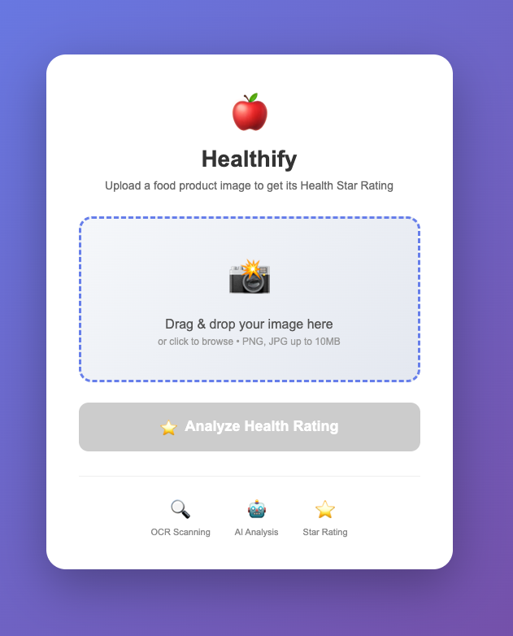
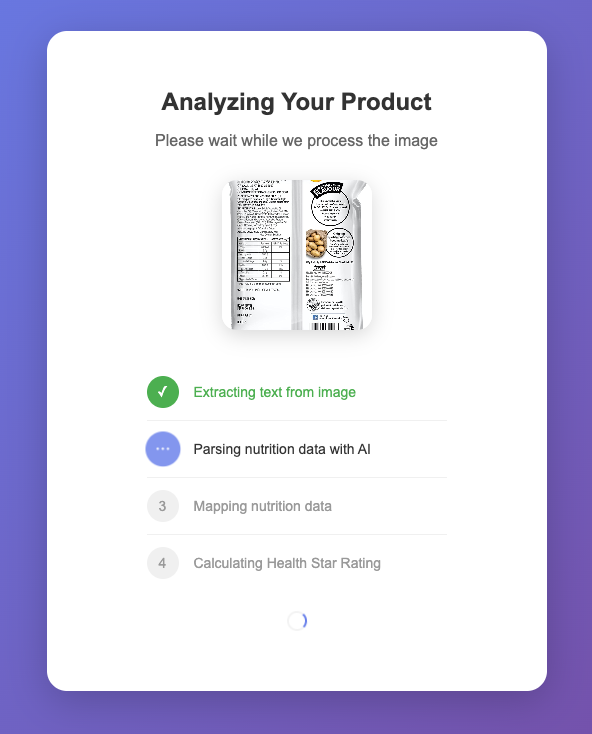
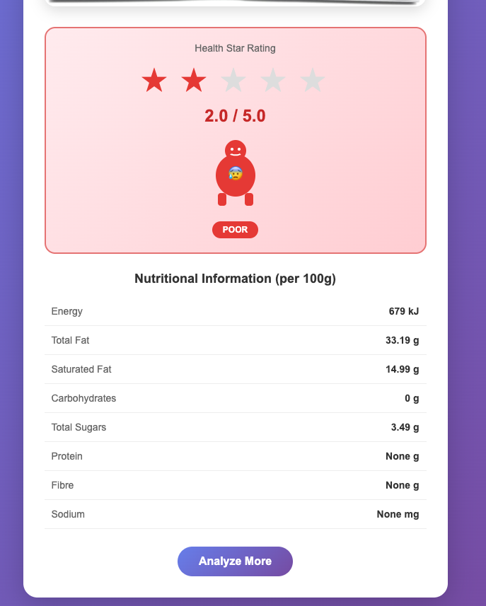

# Healthify — AI-Powered Health Star Rating Analyzer

Upload a photo of a food nutrition label and get its Australian Health Star Rating (HSR) in seconds, powered by OCR and AI.







## How It Works

1. **Upload** — Snap or select a photo of a food product's nutrition label.
2. **OCR** — Tesseract extracts raw text from the image.
3. **AI Parsing** — GPT (via OpenRouter) cleans OCR errors, extracts structured nutrition data, and classifies the product category.
4. **HSR Calculation** — The [Australian Health Star Rating algorithm](http://www.healthstarrating.gov.au/) (FSANZ NPSC standard) computes a 0.5–5 star rating.
5. **Results** — The star rating and full nutrition breakdown are displayed.

Real-time progress is streamed to the browser via Server-Sent Events (SSE).

## Supported Categories

| Code | Category |
|------|----------|
| 1D   | Dairy beverages |
| 2    | General foods |
| 2D   | Dairy foods (yogurt, etc.) |
| 3    | Fats and oils |
| 3D   | Cheese |

## Project Structure

```
├── app.py               # Flask web server (routes, SSE streaming)
├── main.py              # Orchestrator: OCR → LLM → HSR pipeline
├── ocr_extractor.py     # Tesseract OCR text extraction
├── llm_handler.py       # LLM prompts & nutrition/ingredients parsing
├── hsr_calculator.py    # Full HSR algorithm (FSANZ NPSC tables & formulas)
├── templates/
│   ├── index.html       # Upload page
│   ├── loading.html     # Progress/loading page (SSE)
│   └── result.html      # Results page (star rating + nutrition)
├── static/
│   ├── style.css
│   └── uploads/         # Uploaded images
└── requirements.txt
```

## Setup

### Prerequisites

- Python 3.10+
- [Tesseract OCR](https://github.com/tesseract-ocr/tesseract) installed on your system

### Installation

```bash
# Clone the repo
git clone <repo-url>
cd Health-star-rating-project

# Create and activate a virtual environment
python -m venv venv
source venv/bin/activate  # macOS/Linux
# venv\Scripts\activate   # Windows

# Install dependencies
pip install -r requirements.txt

# Install Tesseract (if not already installed)
# macOS:  brew install tesseract
# Ubuntu: sudo apt install tesseract-ocr
# Windows: download from https://github.com/UB-Mannheim/tesseract/wiki
```

### Configuration

Create a `.env` file in the project root with your OpenRouter API key:

```
API_KEY=sk-or-v1-your-openrouter-api-key
```

Get a key at [openrouter.ai/keys](https://openrouter.ai/keys).

### Run

```bash
python app.py
```

Open `http://127.0.0.1:5000` in your browser. Upload a photo of a nutrition label and click **Analyze**.

## Running the HSR Calculator Standalone

```bash
python hsr_calculator.py
```

Includes demo outputs for cereal bars, yogurt, cheese, and olive oil, plus an interactive mode.

## HSR Algorithm Details

The calculator implements the Australian HSR system:

- **Baseline points** (Table A) — scored from energy, saturated fat, total sugars, and sodium per 100g.
- **Modifying points** (Table C) — scored from fruit/veg/nut/legume (FVNL) content, fibre, and protein.
- **Profiler score** = baseline points − modifying points.
- **Star rating** — converted from profiler score using category-specific calibration endpoints.

Different lookup tables are used for Category 1/2 foods vs. Category 3 (fats/oils/cheese).

## Tech Stack

- **Backend**: Python, Flask
- **OCR**: Tesseract (pytesseract) + Pillow
- **AI**: GPT-5.4 Nano via OpenRouter API (OpenAI-compatible)
- **Real-time**: Server-Sent Events (SSE)
- **Frontend**: HTML, CSS, Jinja2 templates